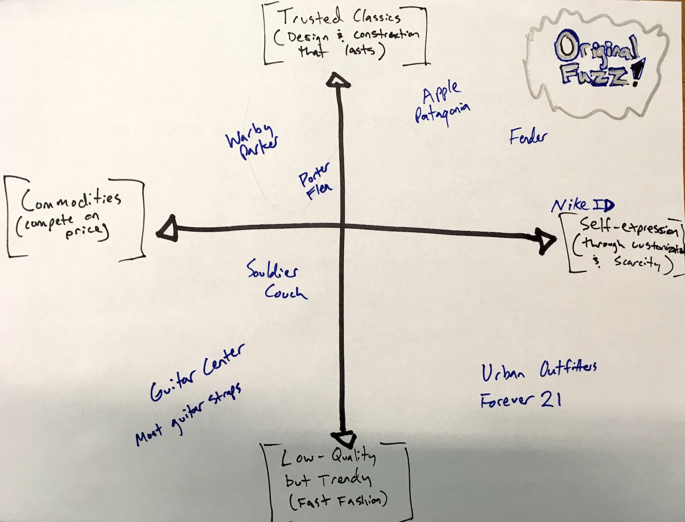

# Our Strategic Position

_Mass customization is future of e-commerce._

In the same way that people are now accustomed to having Netflix recommendations tailored to their unique tastes, they are increasingly expecting this from the brands that provide their physical goods. We believe type of "mass customization" is the future of retail. And that's the broader wave that we're aiming to ride.

Meanwhile, e-commerce will continue to grow as a larger percentage of total retail in the coming decades. By focusing on our website as the hub of all of our sales channels, we can tailor our customer experience to each individual, provide excellent service, and foster a direct relationship with our audience.

## Positioning

X-axis: Self-expression & self-actualization
Y-axis: Trusted classics (via design & construction)

